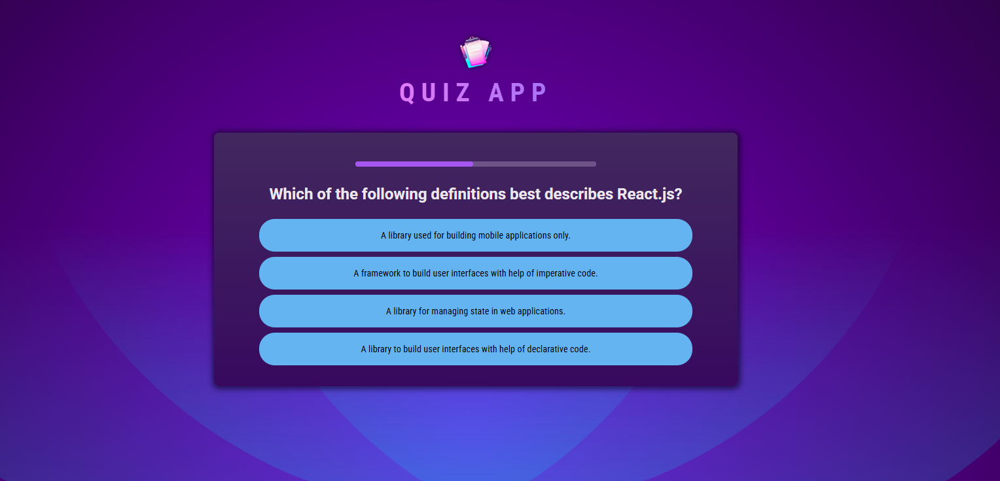

# React Quiz App

Aplicação de quiz desenvolvida em React com o objetivo de praticar conceitos fundamentais da biblioteca, como componentização, estado, hooks e manipulação de eventos.

---

## Preview



---

## Funcionalidades

- Exibição de perguntas de múltipla escolha
- Embaralhamento das alternativas a cada pergunta
- Timer para cada pergunta
- Exibição do resultado final
- Interface simples e responsiva

---

## Tecnologias e conceitos utilizados

- React
- JavaScript (ES6+)
- HTML5
- CSS3

### Hooks utilizados
- `useState`
- `useRef`
- `useCallback`

---

## Como executar o projeto

1. Clone o repositório:
```bash
git clone https://github.com/senarthur/quiz-project
```

2. Acesse a pasta do projeto:
```bash
cd react-quiz-app
```

3. Instale as dependências
```bash
npm install
```

4. Execute a aplicação
```bash
npm start
```
